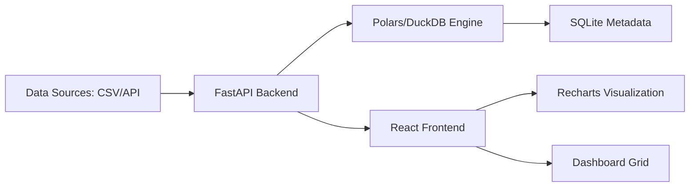

# 📊 SmartDashBoard Maker

**Current Version:** 1.0.0 | **Backend:** FastAPI + DuckDB | **Frontend:** React + Tailwind CSS

SmartDashBoard Maker is a professional-grade, self-hosted data analytics platform designed to bridge the gap between raw data and actionable insights. It combines a powerful **API Data Engine**, a **High-Performance SQL Workbench**, and an **Intuitive Visualization Builder** into a single, cohesive workflow.


---

## 🚀 The Data-to-Insight Workflow

SmartDashBoard Maker follows a logical pipeline to transform data from any source into professional reports:

1.  **Ingestion**: Fetch data from **REST APIs** or upload **CSV/Excel** files (up to 200MB).
2.  **Transformation**: Flatten nested JSON, map schemas, and apply live filters/sorts.
3.  **Analysis**: Use the **DuckDB-powered SQL Workbench** for complex joins and aggregations.
4.  **Visualization**: Build interactive charts (Bar, Line, Area, Pie, KPI) with zero code.
5.  **Composition**: Arrange charts into responsive, drag-and-drop dashboards.

---

## ✨ Key Modules & Features

### 🛠️ Professional API Data Engine
A state-of-the-art interface designed for developers and analysts to integrate external data sources seamlessly.
*   **API Playground**: A Hoppscotch-inspired request builder with support for Headers, Params, Auth (Bearer, API Key, Basic), and a built-in Proxy to bypass CORS issues.
*   **JSON Extract Wizard**: An automated path-extraction tool that flattens deeply nested JSON responses into clean, tabular rows.
*   **Live Schema Mapper**: Reorder columns, rename headers, and set data types before the data even enters your dashboard.
*   **Transformation Pipeline**: Apply real-time filters and sorting logic to preview your dataset before saving.

### ⚡ High-Performance SQL Engine
Powered by **DuckDB** and **Polars**, the backend handles millions of rows with sub-second latency.
*   **SQL Workbench**: A fully-featured SQL editor with syntax highlighting (CodeMirror) for deep-dive analysis.
*   **Schema Discovery**: Automatic detection of data types, null counts, and sample values for every uploaded dataset.
*   **In-Memory Processing**: Data is processed in-memory for maximum speed, then persisted in a local SQLite metadata database.

### 🎨 Intuitive Visualization Builder
Create stunning charts without writing a single line of Javascript or CSS.
*   **Multi-Chart Support**: Bar, Line, Area, Pie, Treemaps, and high-impact KPI cards.
*   **Smart Aggregation**: Instantly calculate `SUM`, `AVG`, `COUNT`, `MIN`, or `MAX` on any numeric column.
*   **Real-Time Previews**: See your changes instantly as you tweak colors, labels, and axes.

### 🧩 Dashboard Composer
Organize your insights into a "Single Source of Truth."
*   **Drag-and-Drop Grid**: A flexible layout engine that lets you resize and move charts anywhere.
*   **Interactive Widgets**: Charts that stay updated as your underlying data changes.
*   **Global Persistence**: Every layout, chart config, and API tether is saved and survives reloads.

---

## 🏛️ Architecture & Tech Stack

### High-Level Architecture


### The Stack
| Layer | Technologies |
| :--- | :--- |
| **Frontend** | React (Vite), Tailwind CSS, Framer Motion, Lucide Icons |
| **Visualization** | Recharts, TanStack Table |
| **Backend** | FastAPI (Python), Uvicorn |
| **Data Logic** | DuckDB (Transactional SQL), Polars (Dataframes) |
| **Storage** | SQLite (for Metadata & Configs), Local FS (for CSV uploads) |

---

## 💡 Real-World Use Cases

### 1. E-Commerce Multi-Channel Tracking
Combine sales data from Shopify (CSV upload) with real-time marketing spend from a Facebook Ads API.
*   **Insight**: Calculate "Return on Ad Spend" (ROAS) by joining two disparate datasets in the SQL Workbench.

### 2. DevOps & Infrastructure Monitoring
Connect the **API Data Engine** to your Prometheus or Datadog endpoints.
*   **Insight**: Build a "System Health" dashboard showing real-time latency peaks and error rates using Area charts.

### 3. Personal Finance & Budgeting
Upload bank statement exports and use the SQL editor to categorize transactions via regex pattern matching.
*   **Insight**: Visualize monthly "Burn Rate" vs. "Income" with a high-contrast KPI dashboard.

### 4. Real Estate Investment Analysis
Fetch property listings via API, use the **JSON Extract Wizard** to flatten the "Features" list, and map it to a table.
*   **Insight**: Compare Average Price per SqFt across different neighborhoods using Bar Charts.

---

## 🏁 Getting Started

### Prerequisites
- Python 3.9+ 
- Node.js 18+

### 1. Setup Backend
```bash
cd backend
python -m venv .venv
source .venv/bin/activate  # On Windows: .venv\Scripts\activate
pip install -r requirements.txt
python main.py
```

### 2. Setup Frontend
```bash
cd frontend
npm install
npm run dev
```

### 3. Launch
Open `http://localhost:5173` in your browser.

---

## 📂 Project Structure
```text
SmartDashBoardMaker/
├── backend/            # FastAPI, DuckDB logic, and SQLite DB
│   ├── routers/        # API Endpoints (Datasets, Viz, Dashboards)
│   ├── services/       # Core business logic (Storage, Query)
│   └── uploads/        # Physical storage for CSV/Excel files
├── frontend/           # React + Vite application
│   ├── src/components/ # Modular UI (API Engine, Viz Builder)
│   ├── src/pages/      # Route-level components
│   └── src/lib/        # API clients and theme context
└── docs/               # In-depth technical manuals
```

---

## 🤝 Contributing
We love contributions! Whether it's fixing a bug, adding a chart type, or improving documentation:
1. Fork the repo.
2. Create your feature branch (`git checkout -b feature/AmazingFeature`).
3. Commit your changes (`git commit -m 'Add some AmazingFeature'`).
4. Push to the branch (`git push origin feature/AmazingFeature`).
5. Open a Pull Request.

---

## 📄 License
Distributed under the MIT License. See `LICENSE` for more information.

---
**Build something amazing with SmartDashBoard Maker!** 🚀
