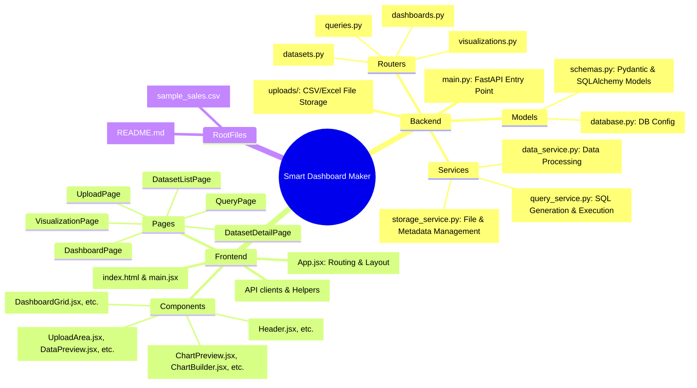

# Smart Dashboard Maker Project Mind Map

Below is a visual representation of the project structure and a detailed explanation of each component.

## Visual Mind Map

---

## Detailed Explanations

### 1. Backend (Python/FastAPI)
The backend is responsible for data processing, database management, and serving the API.

*   **`main.py`**: The entry point of the FastAPI application. It initializes the app, configures CORS, and includes the routers.
*   **`models/`**:
    *   **`database.py`**: Handles SQLAlchemy setup, database engine creation, and session management (defaulting to SQLite `metadata.db`).
    *   **`schemas.py`**: Defines both SQLAlchemy ORM models for database storage and Pydantic models for API request/response validation.
*   **`routers/`**: Modules that handle specific API endpoints:
    *   **`datasets.py`**: Handles CSV/Excel uploads and dataset metadata.
    *   **`queries.py`**: Manages saved queries and SQL execution.
    *   **`visualizations.py`**: Configures and serves chart data.
    *   **`dashboards.py`**: Manages dashboard layouts and saved configurations.
*   **`services/`**: The core business logic:
    *   **`storage_service.py`**: Manages file storage in the `uploads/` folder and database persistence.
    *   **`data_service.py`**: Handles parsing and analyzing uploaded files (e.g., using Pandas).
    *   **`query_service.py`**: Logic for executing SQL against datasets.
*   **`uploads/`**: A storage directory where raw data files (CSV, XLSX) are kept.

### 2. Frontend (React/Vite)
A modern, responsive dashboard builder interface.

*   **`src/App.jsx`**: The central navigation hub using `react-router-dom`. It defines the layout structure and connects all pages.
*   **`components/`**: Reusable UI elements:
    *   **`datasets/`**: Components for file uploading, data grid previews, and column mapping.
    *   **`visualizations/`**: The "Chart Builder" engine, including real-time chart previews (using Recharts).
    *   **`layout/`**: Global elements like the Navigation Header.
*   **`pages/`**: Full-page components corresponding to routes:
    *   **`UploadPage`**: The landing area for adding new data.
    *   **`DatasetDetailPage`**: Detailed view and management of a specific dataset.
    *   **`VisualizationPage`**: The workspace for building charts and graphs.
    *   **`DashboardPage`**: The final view where multiple visualizations are arranged.
*   **`lib/`**: Contains utility functions and the Axios API client configuration for communicating with the backend.
*   **`index.css`**: Global design system, including custom themes and utility classes.

### 3. Root Level
*   **`metadata.db`**: The SQLite database where all project metadata (dataset info, saved charts, dashboard layouts) is stored.
*   **`sample_sales.csv`**: A demonstration file for testing the system.
